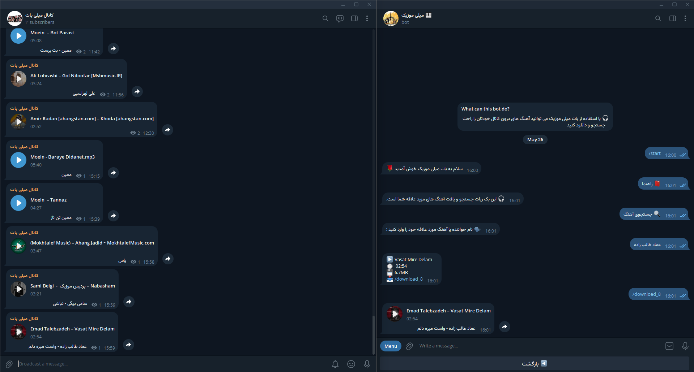
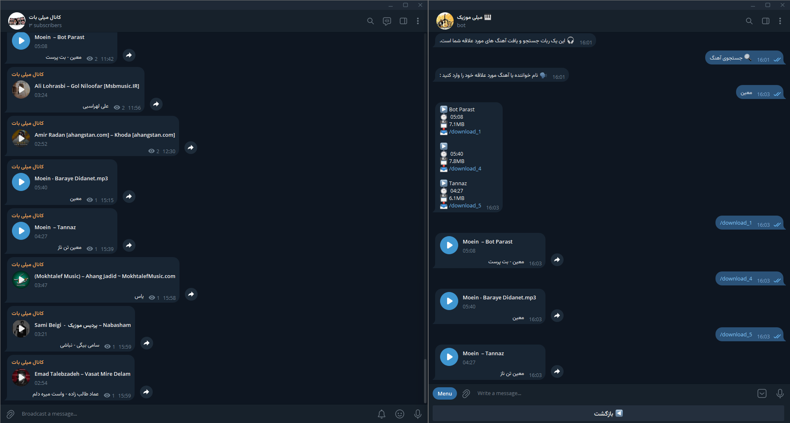
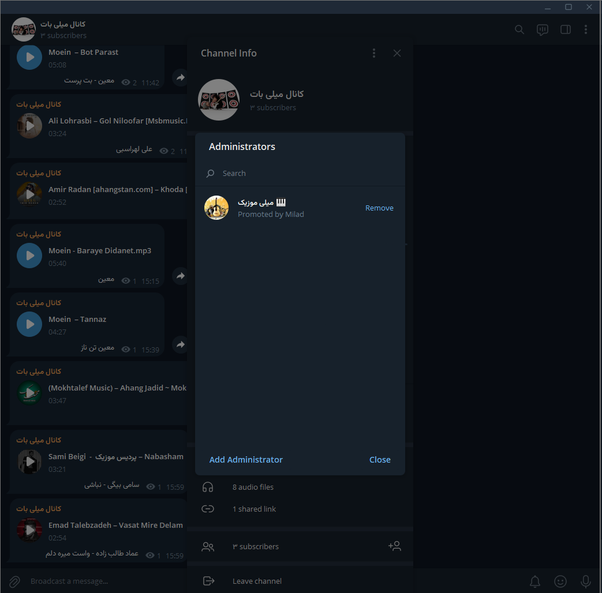

<div align="center">
  <h2 align="center">Search and Find music in channel telegram</h2>
  
  This Bot Telegram Built PHP
  
  <a href="#" target="_blank"><strong>➥ Live Demo</strong></a>
  
</div>

<br />

### Demo Screeshots 🖼️


<br>
<br>

<br>
<br>


### Prerequisites

* MySQL
* PHP
* Host & Domain


### Run Server

Go to Cpanel 🐧:

```bash
1 - select Manage My Databases
2 - Create New Database
3 - Database Users and Add New User/Password
4 - Add User To Database
5 - Then Back Go to PHPMyAdmin select Database
6 - import music.sql
7 - Edit config.php
8 - Run Bot
```


### Contact 💬 
Telegram : <a href="https://t.me/cymilad" target="_blank"><strong>cymilad</strong></a> <br>
Instagram : <a href="https://instagram.com/cymilad" target="_blank"><strong>cymilad</strong></a> <br>
Twitter : <a href="https://x.com/cymilad" target="_blank"><strong>cymilad</strong></a> <br>
Email : <a href="malito:milad1418@yahoo.com" target="_blank"><strong>milad1418@yahoo.com</strong></a>

### License 🪪

This project is **free to use** and does not contains any license.
